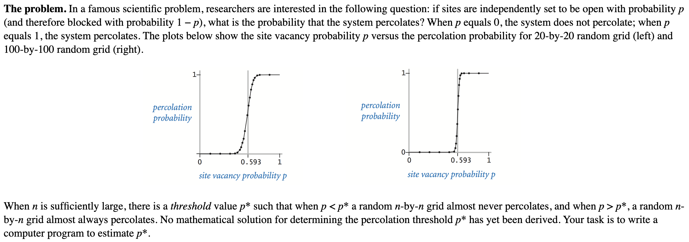

# Module_1

### Reservoir sampling(저수지 샘플링)

- data stream(또는 data set)의 길이(크기)를 모르는 상태에서도 각 항목이 균일한(동일한) 확률로 선택된다.
- 장점: 데이터 스트림의 길이를 미리 알 필요가 없다, 메모리를 아낄 수 있다(Space complexity: O(1)), 한 번의 패스로 항목을 선택할 수 있다.

~~~java
public class RandomWord {
    public static void main(String[] args) {
        int index = 0;
        String result = "";
        
        while(!StdIn.isEmpty()) {
            // read next string
            String word = StdIn.readString();
            // 확률 p로 true를 반환, (1-p)로 false 반환
            boolean accept = StdRandom.bernoulli(1 / (index + 1.0));
            if (accept) {
                result = word;
            }
            index++;
        }
        StdOut.println(result);
    }
}
~~~

- 관련문제(https://leetcode.com/problems/linked-list-random-node/description/)

---

### Percolation(퍼콜레이션, 투과)

- 연결성, 전도성을 확인할 수 있음

